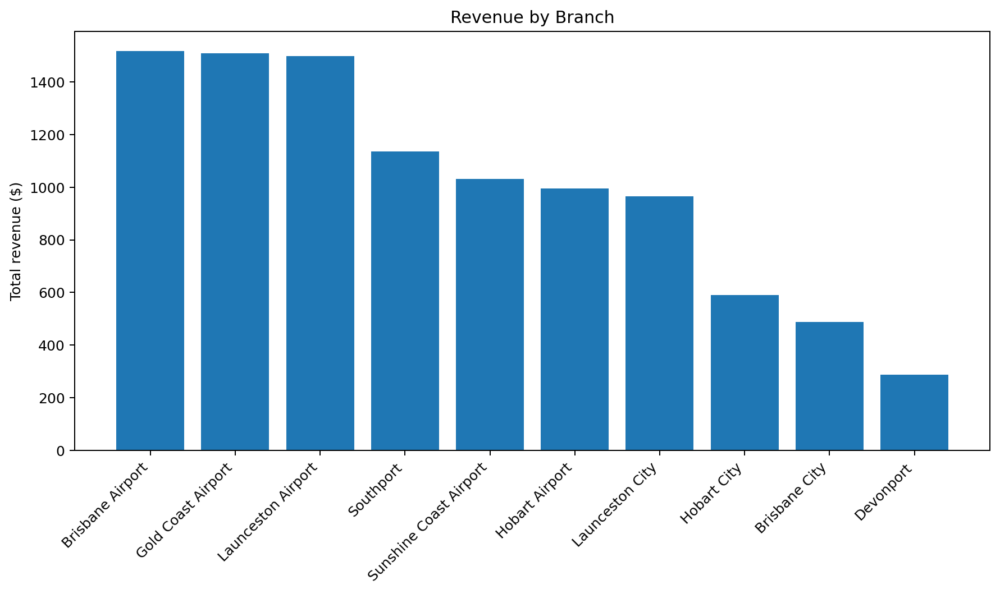
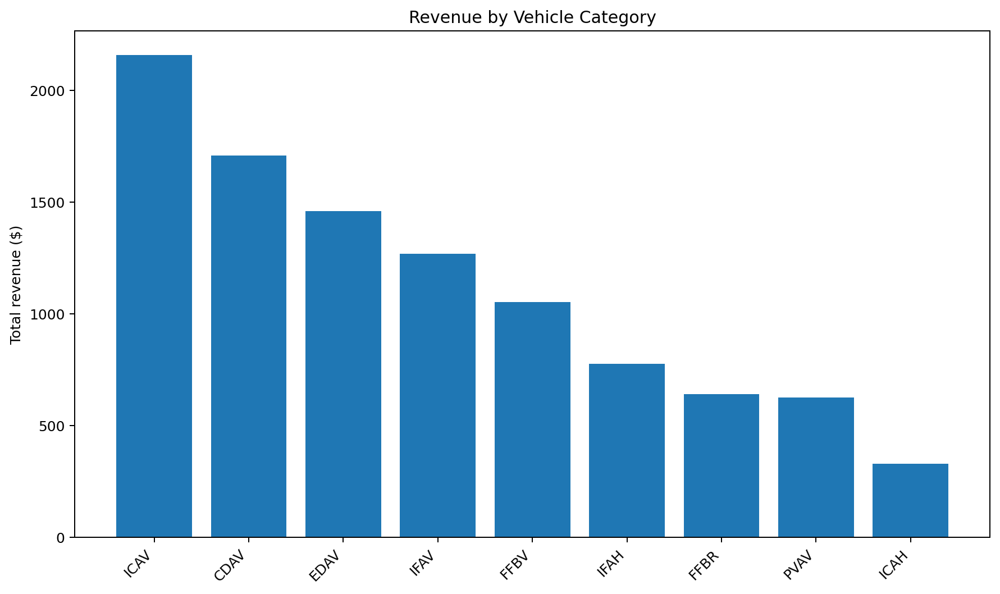
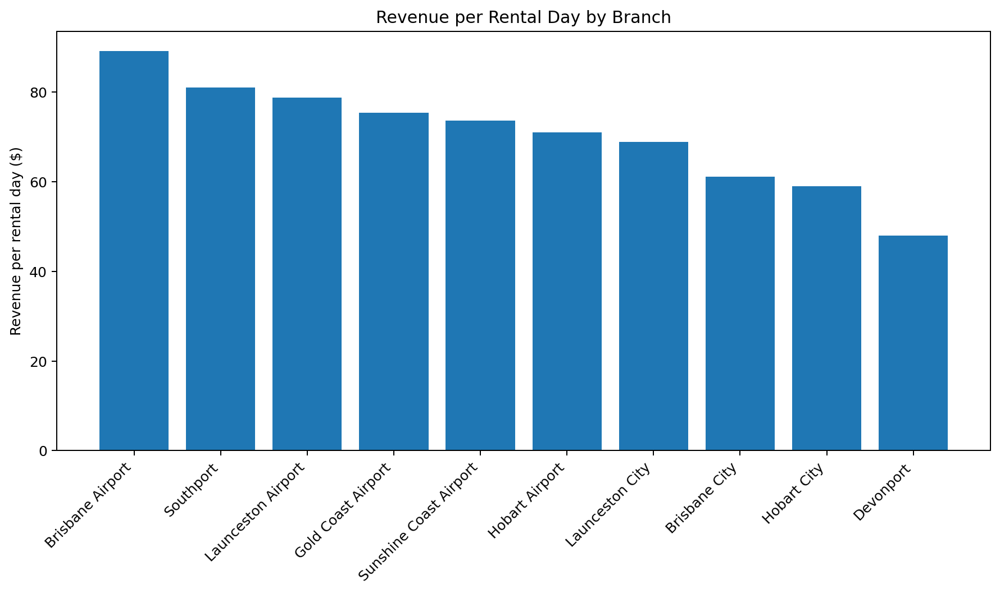
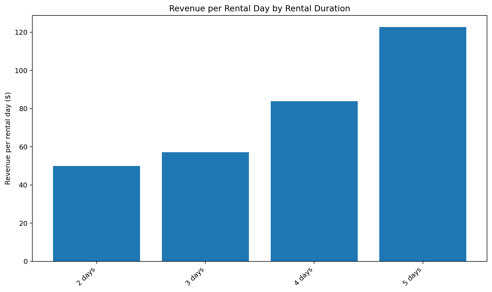

# Car Rental Pricing & Revenue Analytics

A synthetic pricing and revenue analytics project exploring utilisation, yield, fleet availability, and commercial performance in the car rental industry.

## Project Overview

This project uses a SQLite database and SQL analysis to examine car rental pricing, revenue, utilisation, rental duration, vehicle performance, and branch-level commercial performance.

The analysis is based on a synthetic dataset containing:

- 40 completed bookings
- 136 total rental days
- $10,013 total revenue
- 40 vehicles represented in the booking data
- 10 rental branches
- 9 vehicle categories

## Key KPIs

| KPI | Result |
|---|---:|
| Total bookings | 40 |
| Total rental days | 136 |
| Total revenue | $10,013 |
| Average revenue per booking | $250.33 |
| Average revenue per rental day | $73.63 |
| Branches | 10 |
| Vehicle categories | 9 |

---

## Revenue Analysis

### Revenue by Branch



| Branch | Bookings | Rental Days | Revenue |
|---|---:|---:|---:|
| Brisbane Airport | 5 | 17 | $1,516 |
| Gold Coast Airport | 6 | 20 | $1,508 |
| Launceston Airport | 5 | 19 | $1,497 |
| Southport | 4 | 14 | $1,135 |
| Sunshine Coast Airport | 4 | 14 | $1,032 |
| Hobart Airport | 4 | 14 | $994 |
| Launceston City | 4 | 14 | $964 |
| Hobart City | 3 | 10 | $590 |
| Brisbane City | 3 | 8 | $489 |
| Devonport | 2 | 6 | $288 |

### Revenue by Vehicle Category



| Vehicle Category | Bookings | Rental Days | Revenue |
|---|---:|---:|---:|
| ICAV | 8 | 30 | $2,157 |
| CDAV | 10 | 30 | $1,707 |
| EDAV | 11 | 31 | $1,460 |
| IFAV | 4 | 14 | $1,269 |
| FFBV | 2 | 9 | $1,051 |
| IFAH | 2 | 8 | $776 |
| FFBR | 1 | 5 | $640 |
| PVAV | 1 | 5 | $625 |
| ICAH | 1 | 4 | $328 |

---

## Revenue Yield

### Revenue per Rental Day by Branch



| Branch | Revenue per Rental Day |
|---|---:|
| Brisbane Airport | $89.18 |
| Southport | $81.07 |
| Launceston Airport | $78.79 |
| Gold Coast Airport | $75.40 |
| Sunshine Coast Airport | $73.71 |
| Hobart Airport | $71.00 |
| Launceston City | $68.86 |
| Brisbane City | $61.13 |
| Hobart City | $59.00 |
| Devonport | $48.00 |

This metric provides a yield view by comparing branch revenue against the number of rental days.

---

## Rental Duration Analysis



| Rental Duration | Bookings | Rental Days | Revenue | Revenue per Rental Day |
|---|---:|---:|---:|---:|
| 2 days | 2 | 4 | $200 | $50.00 |
| 3 days | 23 | 69 | $3,945 | $57.17 |
| 4 days | 12 | 48 | $4,028 | $83.92 |
| 5 days | 3 | 15 | $1,840 | $122.67 |

The dataset shows higher realised revenue per rental day across the longer rental-duration groups.

---

## Fleet Performance

Fleet performance was analysed by comparing branch fleet size with bookings, rental days, and revenue.

| Branch | Fleet Vehicles | Bookings | Rental Days | Revenue | Rental Days / Vehicle |
|---|---:|---:|---:|---:|---:|
| Brisbane Airport | 5 | 5 | 17 | $1,516 | 3.40 |
| Launceston Airport | 5 | 5 | 19 | $1,497 | 3.80 |
| Southport | 4 | 4 | 14 | $1,135 | 3.50 |
| Sunshine Coast Airport | 4 | 4 | 14 | $1,032 | 3.50 |
| Gold Coast Airport | 6 | 6 | 20 | $1,508 | 3.33 |
| Hobart Airport | 4 | 4 | 14 | $994 | 3.50 |
| Launceston City | 4 | 4 | 14 | $964 | 3.50 |
| Hobart City | 3 | 3 | 10 | $590 | 3.33 |
| Brisbane City | 3 | 3 | 8 | $489 | 2.67 |
| Devonport | 2 | 2 | 6 | $288 | 3.00 |

---

## Key Findings

### 1. Branch revenue varies substantially

Total branch revenue ranges from $288 at Devonport to $1,516 at Brisbane Airport.

### 2. ICAV is the largest revenue category

ICAV generated $2,157 in revenue across 8 bookings and 30 rental days.

### 3. Longer rentals have higher realised daily revenue

Revenue per rental day increases across the observed rental-duration groups:

- 2 days: $50.00
- 3 days: $57.17
- 4 days: $83.92
- 5 days: $122.67

### 4. Branch yield differs from total revenue

Brisbane Airport generated $89.18 per rental day, while Devonport generated $48.00 per rental day.

This demonstrates why total revenue and revenue yield should be analysed separately.

---

## SQL Analysis Library

The project contains a series of SQL analyses covering different commercial questions:

| Analysis | Focus |
|---|---|
| [01 — Data Quality](sql/01_data_quality.sql) | Data validation and integrity checks |
| [02 — Revenue Analysis](sql/02_revenue_analysis.sql) | Overall revenue performance |
| [03 — Utilisation](sql/03_utilisation.sql) | Rental utilisation by vehicle category |
| [04 — Branch Pricing](sql/04_branch_pricing.sql) | Pricing and revenue by branch |
| [05 — Category Pricing](sql/05_category_pricing.sql) | Pricing by vehicle category |
| [06 — Rental Duration](sql/06_rental_duration.sql) | Pricing by rental duration |
| [07 — Weekday vs Weekend](sql/07_weekday_weekend_pricing.sql) | Pricing differences by day type |
| [08 — Branch Category Pricing](sql/08_branch_category_pricing.sql) | Branch/category pricing combinations |
| [09 — Monthly Pricing Trend](sql/09_monthly_pricing_trend.sql) | Monthly pricing and revenue |
| [10 — Fleet Performance](sql/10_fleet_performance.sql) | Fleet size and utilisation |
| [11 — Category Revenue Contribution](sql/11_category_revenue_contribution.sql) | Revenue contribution by category |
| [12 — Booking Status Overview](sql/12_booking_status_overview.sql) | Booking status and revenue |
| [13 — Branch Revenue per Rental Day](sql/13_branch_revenue_per_rental_day.sql) | Revenue yield by branch |
| [14 — Vehicle Performance](sql/14_vehicle_performance.sql) | Vehicle-level performance |
| [15 — Rental Duration Revenue](sql/15_rental_duration_revenue.sql) | Revenue by rental duration |

---

## Data Quality

The project includes SQL validation checks covering:

- Revenue calculation consistency
- Foreign-key relationships
- Date validity
- Rental duration validity
- Pricing boundaries
- Vehicle-category pricing coverage

The completed data-quality checks found no mismatched revenue calculations, orphan foreign keys, invalid rental dates, invalid rental durations, or invalid pricing bounds in the analysed dataset.

---

## Tech Stack

- **SQLite** — relational database
- **SQL** — analysis and business metrics
- **CSV** — source datasets
- **Git & GitHub** — version control and project presentation
- **Markdown** — documentation and reporting
- **PNG charts** — visual analysis

---

## Project Structure

```text

├── charts/
│   ├── branch_revenue.png
│   ├── category_revenue.png
│   ├── revenue_per_rental_day.png
│   └── rental_duration_revenue.png

├── data/
│   ├── bookings.csv
│   ├── branches.csv
│   ├── fleet.csv
│   └── pricing.csv

├── database/
│   └── car_rental.db

├── sql/
│   ├── 01_data_quality.sql
│   ├── 02_revenue_analysis.sql
│   ├── ...
│   └── 15_rental_duration_revenue.sql

└── README.md
## Purpose

Raw data → SQLite database → SQL analysis → business metrics → visualisation → GitHub portfolio.

```
